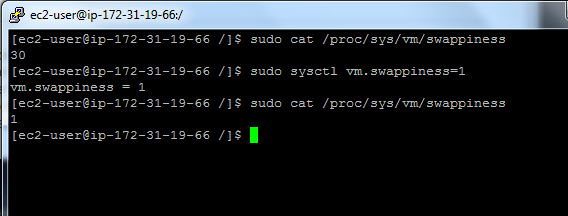

## <center> <a name="pre_install"/> Day 1 - 01/05/2017

1. Swapiness
```
$ sudo cat /proc/sys/vm/swappiness
$ sudo sysctl vm.swappiness=1
```
<center>  </center>

2. Show Mount 
```
$ mount
$ mount -t ext
```
3. 
* This step is not required

4. Disable transparent hugepage support
```
$ cat /sys/kernel/mm/transparent_hugepage/enabled
$ echo never > /sys/kernel/mm/transparent_hugepage/enabled
```
---
<div style="page-break-after: always;"></div>

## <center> <a name="aa"/> Day 2 - 02/05/2017

5. List your network interface configuration
```
[ec2-user@ip-172-31-21-188 ~]$ netstat -i
Kernel Interface table
Iface      MTU    RX-OK RX-ERR RX-DRP RX-OVR    TX-OK TX-ERR TX-DRP TX-OVR Flg
eth0      9001      702      0      0 0           699      0      0      0 BMRU
lo       65536        4      0      0 0             4      0      0      0 LRU

```
